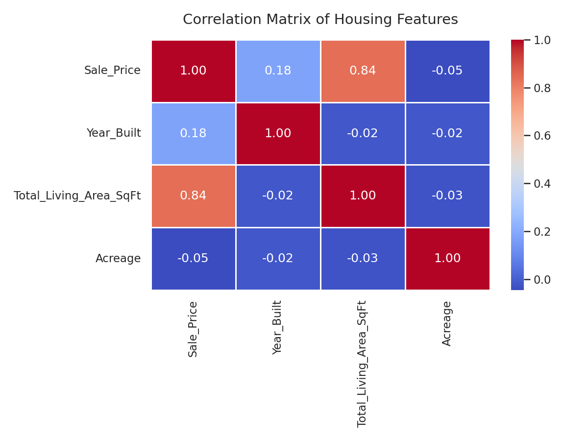
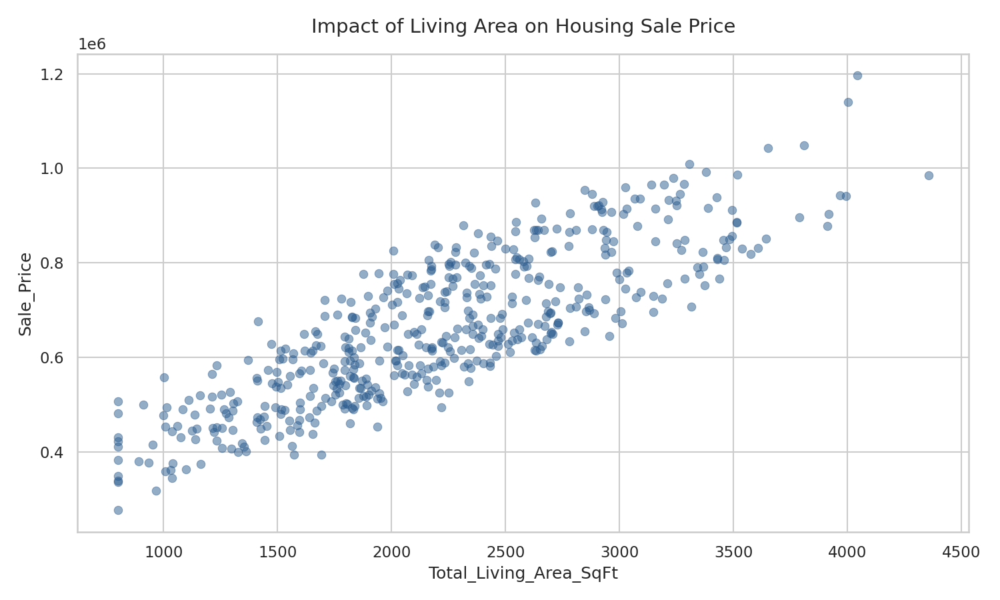

# wake-county-real-estate-analytics
A predictive modeling project using machine learning to forecast single-family residential property values in Wake County, NC.

### Wake County Housing Market Analytics & Predictive Modeling

An end-to-end data science project analyzing housing market trends, structural property values, and single-family home pricing drivers across **Wake County, North Carolina**. 

### 📌 Executive Summary

This project investigates the primary drivers of real estate valuation within Wake County, NC. Leveraging Python and machine learning, the project cleans historical municipal property logs, engineers neighborhood-specific geographic features, and deploys predictive models to forecast residential sale prices. 

* **The Goal:** Build a robust workflow to accurately evaluate property values and surface undervalued opportunities for buyers and investors.
* **The Tools:** Python, Jupyter Notebooks, Git, and AI-assisted development tools for optimization.

### 💼 The Business Problem

Real estate markets are highly localized and dynamic. Traditional pricing estimation methods often fail to scale or capture nuance across rapid-growth areas like the Research Triangle. This project acts as an automated decision-support system to answer critical real estate investment questions: 

1. Which property structural attributes (square footage, age, lot size) correlate most strongly with an increased market premium?
2. How do local macroeconomic shifts or regional geographic boundaries influence price-per-square-foot disparities?
3. Can a machine learning framework reliably predict sale prices to assist investors in identifying undervalued properties?

### 📊 The Dataset

The underlying data is sourced from the official **Wake County Open Data Portal** alongside curated subsets of single-family residential transactions. 

* **Data Scale:** Over 62,000 property records spanning historical sales from 2024 to 2026.
* **Key Features Explored:** 

  * Sale Price (Target variable)
  * Year Built & Effective Year Built
  * Total Living Area (Square Footage)
  * Acreage (Lot Size)
  * Zoning Class & City/Township designation

### ⚙️ Methodology & AI Collaboration

This workflow was developed using a structured data science pipeline, utilizing advanced AI collaboration workflows to accelerate code generation, error debugging, and model benchmarking: 

1. **Data Cleaning & Imputation:** Addressed systematic missing data structures in building materials and structural ages. Outliers in extreme sale valuations were filtered using statistical IQR rules.
2. **Feature Engineering:** Calculated continuous age features (Property Age) and grouped granular municipal zones into unified regional location flags.
3. **Exploratory Data Analysis (EDA):** Generated multi-variable correlation matrix heatmaps to isolate top-tier predictive elements.
4. **Model Architecture:** Trained and cross-validated multiple regression frameworks—ranging from baseline Linear Regression to ensemble methods like XGBoost and Random Forest.

## 📈 Key Findings & Insights

### 1. Feature Correlations
This heatmap visualizes how closely interconnected different house features are with the ultimate transaction value.
 

### 2. Living Area vs. Market Value
Total living area (square footage) functions as the anchor driver of property valuations, displaying a highly linear trend line.
 

